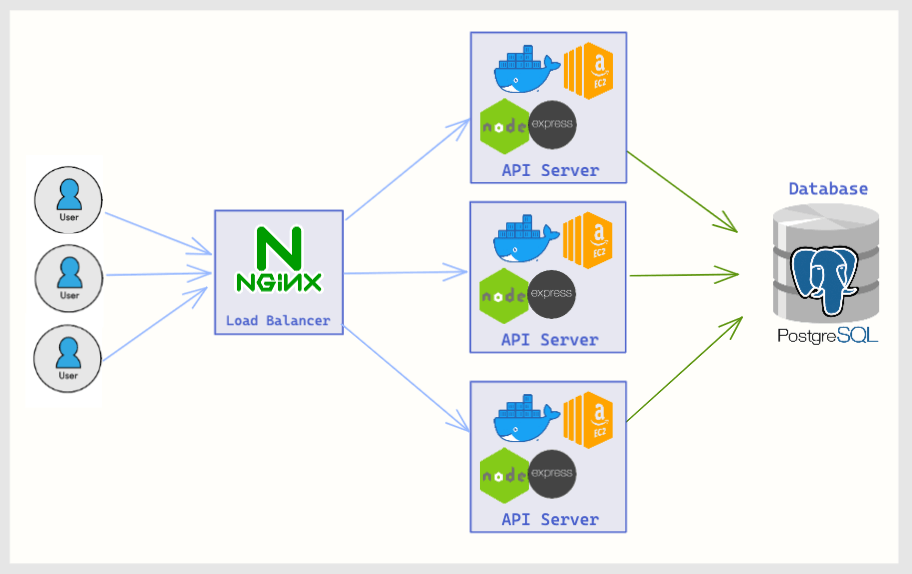

# Project Atelier API [](https://github.com/sdc-bareminimum/project-catwalk-related-service/actions/workflows/main.yml) [](https://coveralls.io/github/sdc-bareminimum/project-catwalk-related-service?branch=main)

[Hack Reactor](https://www.hackreactor.com/) System Design Capstone Project, which involved scaling the **Node.js RESTful API** to handle x50 more traffic and reducing p90 latency to ~70ms (-95%). Developed NGINX load-balancer, optimized the PostgreSQL database, and preformed load-testing with K6 and Loader.io.

     

## 🌟 Project Overview:

**Situation:** Refactoring a Node.js RESTful API deployed on AWS EC2, serving retail product data from a PostgreSQL database.

**Task:** Optimize and scale the API to handle production level traffic with low latency and <1% error rate. This backend was crucial to have ready for the next project, which was the frontend serving this data. It was a challenge without using a Kubernetes cluster or database sharding.

**Action:** Dockerized the API for horizontal scaling with the NGINX proxy service. Used the dynamic least connection algorithm for load balancing to distribute traffic.  Optimized the Node.js app  with caching, refactoring database queries, and other minor code improvements.  Identified and resolved system bottlenecks with load testing using K6 and Loader.io.

**Result:** Achieved traffic from <10 RPS to reliable 700 RPS with 70 ms average latency and <1% error rate. Avoided breaking changes with testing and continuous integration, decreasing the stress testing cycle length to allow  quick iteration of the system..

## 📈 Preformance Results

#### Target Preformance
- [ ] Throughput: 100 RPS
- [ ] Latency: 2000 ms
- [ ] Error rate: <1% rate

#### Actual Preformance
- [x] Throughput: ~700 RPS (Max 5000 RPS)
- [x] Latency: ~70 ms
- [x] Error rate: <1% rate

## System Architecture



## 📦 Technologies:
- [NGINX](https://www.nginx.com/)
- [Docker](https://www.docker.com/)
- [AWS EC2](https://aws.amazon.com/ec2/)
- [Postgres](https://www.postgresql.org/)
- [Node.js](https://nodejs.org/en/) / [Express](https://expressjs.com/)
- [Jest](https://jestjs.io/)
- [GitHub Actions](https://github.com/features/actions)

## ⚙️ Local Development

```sh
# [optional] Run the local postgres database
$ cd postgres_db
$ docker-compose up -d --build

# Start up the Node/Express server
$ cd server/app
$ npm install
$ cp .env.sample .env

# Update the DATABASE_URL environment variable
EXAMPLE_URL=postgresql://<username>:<password><host>:5432/<database>
```

## 🌐 API Documentation

See [ATELIER_API_DOCS.md](./ATELIER_API_DOCS.md) to view the endpoint schema

## 🗃️ Ticket System

Check out the [Trello Scrum Board](https://trello.com/b/Ua5qkKmA/trello-system-design-capstone) used to plan user stories and create tasks during development.

## Engineering Journal

Read about learning/challenges of this project:
- [PDF](resources/system_design_project_engineering_journal.pdf) &nbsp;
- [JOURNAL.md](resources/JOURNAL.md)
- [Google Doc](https://docs.google.com/document/d/1pTTeDCzcKNozd9dljexVn-PrXwzoTBS0hby2dOZ95yw)
