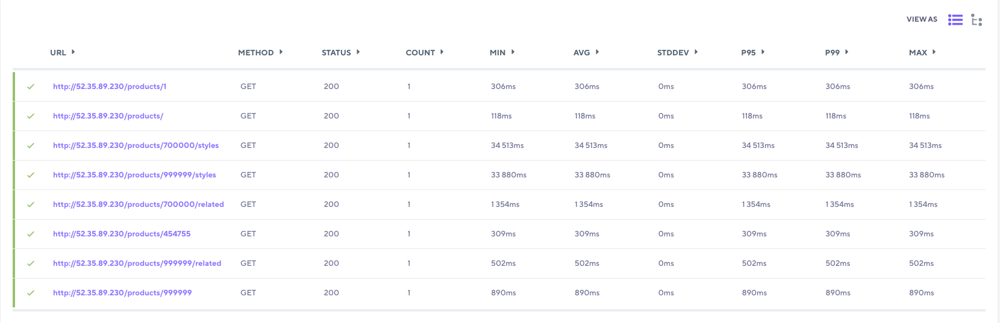
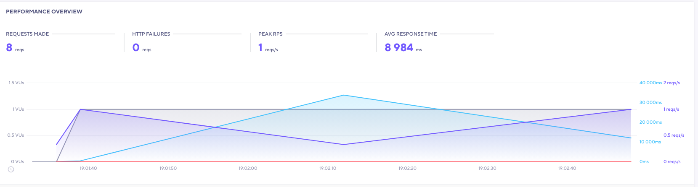

# Test A
### API Setup:
- EC2 Node Server Instance: `59.10.35.290`
- EC2 Postgres Database Instance: `54.218.13.73`
- NO LOAD BALANCER

This first test below is hitting the deploy Node Server, which will fetch from the deployed database also.

# TARGET PREFORMANCE
**Throughput:** 100 RPS
**Latency:** 2000ms
**Error rate:** <1% rate

`const host = '59.10.35.290'`

## Requests:
method: "GET",
address: `http://${host}/products/`,

name: "Product Info Ending",
method: "GET",
address: `http://${host}/products/999999`,

name: "Product Info Middle",
method: "GET",
address: `http://${host}/products/454755`,

name: "Product Info Beginning",
method: "GET",
address: `http://${host}/products/1`,

name: "Product Styles A",
method: "GET",
address: `http://${host}/products/999999/styles`,

name: "Product Styles B",
method: "GET",
address: `http://${host}/products/700000/styles`,

name: "Product Related A",
method: "GET",
address: `http://${host}/products/700000/related`,

name: "Product Related B",
method: "GET",
address: `http://${host}/products/999999/related`,

